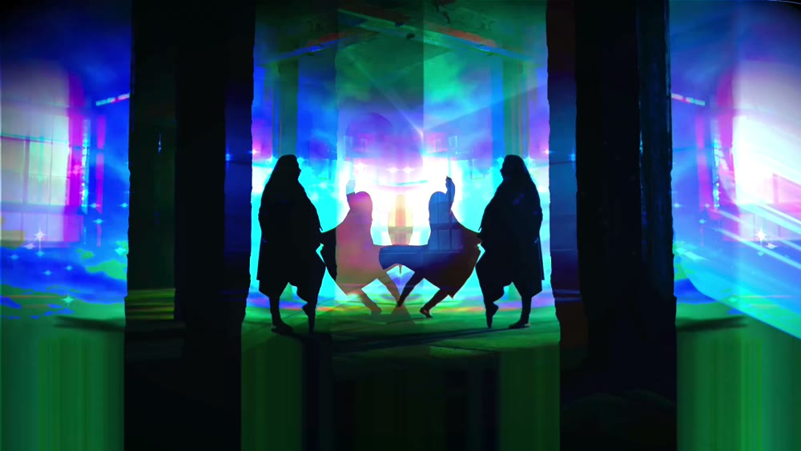

# The Art

Ariadne is paired with an original piano piece and a short film, and they are as much the project as the code is. The myth, the music, the visuals, and the software are one story told from four sides, the navigation of a labyrinth and the thread that leads back out. It is the idea that care, memory, and clear boundaries are what let you venture into something dangerous and still find your way home, in the myth, in the music, and in the code.

  

Watch the full short film here.
https://youtu.be/5tpyjqRoxCQ

## The music

The piano piece is in C harmonic minor. It moves down into the minor key, climbs to a high and exposed quiet middle, arrives, and then returns to quiet. It is the same arc the agent walks, in low and careful, deep into the unknown, and back out along the thread.

## The film

The film traces the journey in pictures. It opens in a dark tangle of branches, the labyrinth as a net. It moves through doubled and shifting selves, the colors splitting and recombining. It gathers to a dancing center, and it ends at a lit door. The multiplied dancers are the concurrent agents, the fleet that walks the maze in parallel, many threads laid at once and every one of them still finding the way back.

## The score and the MIDI

The full piano score and the MIDI are in the repository, the score at [docs/ariadne-score.pdf](docs/ariadne-score.pdf) and the MIDI at [docs/ariadne.mid](docs/ariadne.mid). The piece is written in C harmonic minor. They are here partly because they are useful and partly because a score and a MIDI are the plainest record that a person sat at a keyboard and wrote this.

## A note on authorship

The piano piece and the short film are my own original composition, performance, and production. No AI was used to make either of them. The only autonomous agent in this project is the one being tested.

Back to the [project](README.md).
