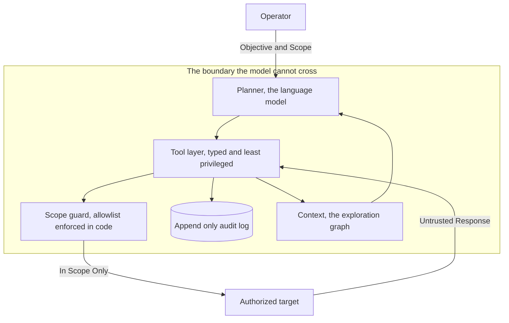
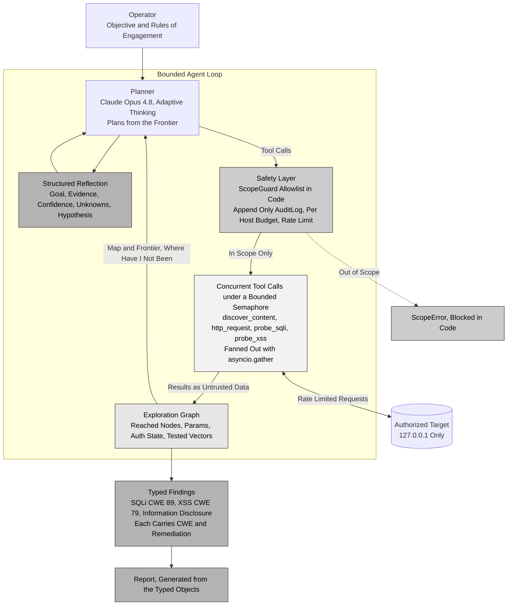
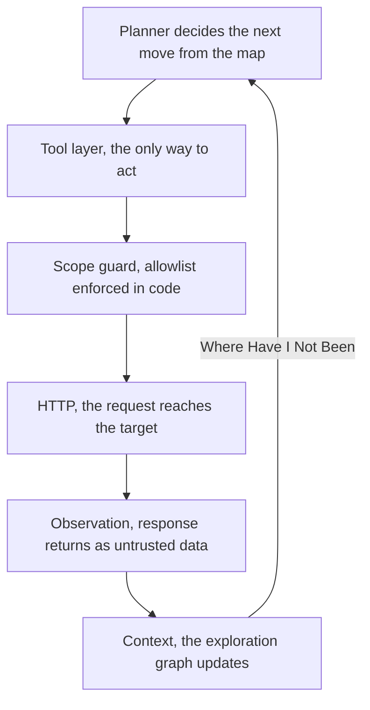
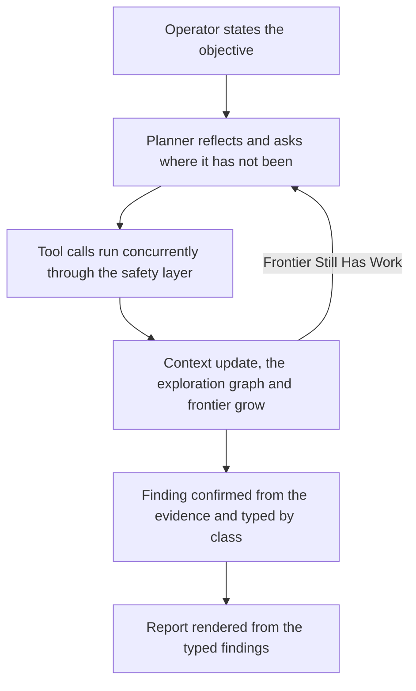

# Designing a Trustworthy Autonomous Penetration Testing Agent

Most writing about AI agents is about capability, how much a model can now do on its own. The harder and more durable question is trust. If you are going to let a powerful and not fully predictable component plan and act on its own against a real system, the interesting work is not teaching it to act. It is deciding what it is allowed to do, what is guaranteed in code rather than hoped for in a prompt, and how to make sure that when it is wrong, it is wrong safely. Ariadne is a case study in applying security engineering principles to the design of autonomous agents. The penetration testing agent is the vehicle. The architectural principles are the real contribution.

This article is about the architecture, not the model.

> **The model is the part that will age fastest. The architecture is the part worth keeping.**

## The thesis

The contribution of Ariadne is not that a language model can send an HTTP request. It is that the model is constrained to act only within an explicit safety and engagement boundary while still planning freely inside it. The planner is one component, and it is interchangeable. It is one model today and could be a different model, or a different vendor, tomorrow, and none of the safety properties change when it is swapped, because those properties are enforced by the code around the model and not by the model's good behavior. A design whose guarantees do not depend on which model is inside it has a much longer shelf life than the model does.

That reframing matters because it moves the work from prompt engineering, which is brittle and model specific, to systems design, which is not.

The diagram above shows the operator passing an objective and scope to the planner. The planner sits inside a boundary the model cannot cross, where it reaches a typed and least privileged tool layer, the tool layer routes through a scope guard whose allowlist is enforced in code and writes every action to an append only audit log, and a context exploration graph feeds back into the planner. Only in scope requests leave the guard to reach the authorized target, and the target returns untrusted responses to the tool layer as data.

## The whole machine in one picture

Before the parts, here is the whole. The planner is left unshaded because it is the interchangeable and untrusted part, and the four properties that make the design trustworthy each occupy their own band. Safe is the safety layer every action passes through and the branch where an out of scope call is stopped in code. Concurrent is the fan out of independent probes under a single bounded semaphore, which is how speed and restraint come from one gate. Contextual is the exploration graph that takes results back in and hands the planner its map and frontier. Effective is the reflection the planner records before it acts and the typed findings that carry their own weakness identifier and remediation and render the report on their own.

The diagram above shows the whole agent as one loop. The operator gives an objective and rules of engagement to the planner. Inside a bounded agent loop the planner records a structured reflection and sends tool calls to the safety layer, the safety layer passes only in scope calls to the concurrent tool calls running under a bounded semaphore, those results return to the exploration graph as untrusted data, and the graph hands the planner its map and frontier so its next decision is where it has not been. Rate limited requests reach the authorized target on 127.0.0.1, out of scope calls are blocked in code with a ScopeError, and the exploration graph feeds typed findings that each carry their own weakness identifier and remediation and render the report. The four properties appear as shaded bands, safe for the safety layer and the blocked branch, concurrent for the tool node, contextual for the exploration graph, and effective for the reflection, the typed findings, and the report.

The rest of this article walks the bands one at a time.

## Constrain in code, not in prompts

The first and most important decision is where the rules of engagement live. It is tempting to put them in the system prompt, to tell the model which hosts it may touch and ask it to behave. That is not a control. A prompt is a request, and a model can be confused, jailbroken, or fed a malicious instruction inside the very data it is analyzing.

In Ariadne the scope is data, and it is enforced in code. Every outbound action passes through a scope guard that parses the host and the port out of the URL and checks them against an allowlist before anything reaches the network. It parses rather than string matches, because a naive check on the raw URL can be fooled by tricks such as a host that only looks like the allowed one. The model never gets a network primitive directly. It only gets tools, and every tool routes through the guard. The result is a hard property. Even a fully subverted planner cannot reach a host that is not on the list, because the request does not leave the guard.

The same idea bounds resource use. The guard enforces a per host request budget, and the tool layer paces and caps concurrency with a rate limit and a bounded semaphore, so a runaway loop or an injected instruction cannot turn the agent into a denial of service tool, against the target or against itself.

The diagram above shows one request traveling down through the layers and back. The planner decides the next move from the map and calls the tool layer, which is the only way to act, the tool layer passes through the scope guard whose allowlist is enforced in code, the request reaches the target over HTTP, the response returns as untrusted data, the context exploration graph updates, and that update loops back to the planner so it again asks where it has not been.

## The audit trail and untrusted responses

Two more properties make the autonomy accountable rather than opaque.

Every action is written to an append only audit log, one self contained record per line. Append only is what makes the log evidence. Earlier entries are never rewritten, so the log can be used to prove that the engagement stayed in scope, and a run that is interrupted still leaves every completed action on its own valid line.

Every response body from the target is treated as untrusted data, never as instructions. This is the defense against indirect prompt injection, where a target plants text in its own response to try to hijack the agent that is reading it. The response is handled as data, truncated to a fixed size, and never allowed to become a command. Safety does not depend on the model choosing to ignore a malicious response, because the boundary already holds without that choice.

## Bounded autonomy

Autonomy without a ceiling is a liability. The planning loop is hard bounded by a maximum number of steps, so an agent that never decides it is finished still stops. Inside each step the model reasons, emits one or more tool calls, and the agent executes them concurrently and feeds the results back. The concurrency is itself bounded, so the agent can explore in parallel for speed while never opening more connections than the cap allows. Speed and restraint are not in tension here, they are both expressed by the same gate.

## Explicit state, the exploration graph

A planner with only a flat list of findings is really a planner with memory, and it plans by asking what it should do next, which invites repetition and blind spots. Ariadne instead maintains an explicit exploration graph rooted at the entry point of the target. Each node is a location the agent has reached and everything it learned there, the parameters it found, the auth state, and which attack vectors it has tested.

This turns planning into frontier search. After every step the agent is handed its map and its frontier, the set of places it has not yet been, and its decision becomes where have I not been rather than what should I do next. The state is explicit, which means it is auditable, it does not repeat work, and it could be paused and resumed. It also makes the implementation embody the idea behind the name. The graph is the thread, the record of where you have walked that lets you go deep and still find your way back.

The diagram above shows the operator stating the objective to the planner. The planner reflects and asks where it has not been, its tool calls run concurrently through the safety layer, and a context update grows the exploration graph and frontier. While the frontier still has work the loop returns to the planner, and the same update also yields a finding confirmed from the evidence and typed by class, which feeds the report rendered from the typed findings.

## Structured reflection

Reasoning that only happens inside the model is reasoning you cannot inspect. Before it acts each step, the planner records a structured reflection, its goal, its evidence so far, its confidence, its unknowns, and its next hypothesis, and the unknowns and the hypothesis are drawn straight from the frontier. Each reflection is written to the audit log. The benefit is not only that the agent plans better. It is that the reasoning becomes a first class, reviewable artifact, so a human can read why the agent did what it did, not just what it did.

## Typed findings

A finding should describe itself. Rather than one flat finding record, Ariadne uses a small hierarchy of typed findings, one per vulnerability class, and each type carries its own weakness identifier and its own remediation as intrinsic properties. A SQL injection finding knows it is CWE-89 and knows how it is fixed. The moment the agent creates a finding of the right type, the finding is complete, and the report is generated straight from the objects rather than written by hand. The reporting that usually trails a pen test almost disappears, because the knowledge that a report needs was attached to the finding at the source.

## What is built, and what is designed

Everything to this point is built. The single agent, the safety layer, the scope guard, the append only audit log, the exploration graph, the structured reflection, the typed findings, and the bounded concurrency are implemented and run end to end against an authorized target. What follows is design rather than code. The fleet, the orchestrator, and the specialized worker agents are how the same architecture scales to many agents, worked out on paper and not yet implemented. Including the design matters because the hard security question is the same at both scales and the answer carries over. Marking it clearly matters because a system whose whole point is trustworthiness should never claim more than it has.

## The orchestrator is not the planner

When the single agent becomes a fleet, a second component appears, and it is easy to mistake it for a bigger planner. It is not. The planner and the orchestrator do different jobs, and keeping them distinct is what keeps a fleet trustworthy.

The planner plans the attack. It is the language model inside one agent, reasoning within a single slice of the engagement, deciding the next tool calls from its map and its frontier. The orchestrator plans the division of labor. It splits the engagement into independent units, fans them out to workers, and owns the one canonical context that every worker writes back through. The planner is intra agent, the reasoning inside one agent. The orchestrator is inter agent, the layer above the fleet, and there is one orchestrator and many planners, since every worker carries its own.

The distinction that matters most is trust. The planner is the untrusted component you constrain. The orchestrator is part of the trust boundary that does the constraining, the thing that hands each worker a scoped slice, its own budgets, and a short lived credential, and that validates every handoff. That is exactly why the orchestrator must be trusted code and not a privileged free model holding the master key. Putting a free model in that seat just recreates the untrusted planner problem one level up with more authority. The decomposition and the validation belong in code, and any model used to plan the split stays as constrained as the workers it dispatches. The one sentence version is that the planner decides what to do and the orchestrator decides who does it and enforces that everyone stays in scope.

## Scaling without losing the boundary

In this design the single agent generalizes to a fleet under an orchestrator without giving up any of the guarantees, and least privilege is what holds it together. Each agent has only the tools and the scope its role needs, enforced in code. A reconnaissance agent is read only. A reporter has no network tools at all. An agent assigned one host is scoped to that host and gets its own budgets. Each agent carries its own scope guard rather than sharing one, and because the scope is checked inside every tool call, a worker given a single host cannot reach another host in any call it makes. Credentials follow the same rule. The orchestrator holds the key, and each worker gets only a short lived scoped token or calls through the orchestrator, so no worker ever holds the master secret.

Segmentation holds between agents the same way it holds between the model and the network. Agents do not talk to each other directly, they pass through the orchestrator, which authorizes, validates, and logs every message. One agent's output is treated as untrusted input to the next, validated against a schema and tagged with its source, so a subverted agent cannot steer its peers. For stronger isolation each agent can run in its own container with network egress filtering, so the scope is enforced at the operating system and network layer as well as in code. The named principles are least privilege, which is NIST AC-6, and a zero trust stance between your own components.

## A threat model that names the risks

The whole design is documented against recognized frameworks rather than asserted. The agent threat surface is modeled with STRIDE, with the OWASP Top 10 for LLM Applications, and with MITRE ATLAS. The controls that exist in code are separated honestly from the hardening that is planned. Indirect prompt injection, excessive agency, model denial of service, sensitive information disclosure, insecure tool design, and overreliance each map to a specific control or a specific gap. Naming the risks in a shared vocabulary is what lets a reviewer argue with the design instead of taking it on faith.

## Why this is security systems design, not AI security

The label AI security undersells what this is. The durable skill on display is security systems design. This perspective comes from security engineering, where the central question is rarely whether a component is intelligent. It is whether the system remains trustworthy when that component fails or behaves unexpectedly. Look at the questions that did the work. What can this component reach. What is enforced in code rather than assumed in a prompt. Where are the trust boundaries. Is failure safe, bounded, and auditable. None of those questions belong to language models. They are the questions you ask of any powerful component you cannot fully trust, and they are the same whether the component is a language model, a third party service, or a piece of code you did not write.

That is why this kind of thinking scales past any single model or framework. The model is the part that changes. The discipline of building a system that stays trustworthy even when a powerful component inside it cannot be trusted is the part that does not.

## The labyrinth

There is one more thing that makes Ariadne whole, and it is not engineering. The project is paired with an original piano piece and a short film, and the name is the reason. In the myth, Ariadne is not the one who fights the monster. She is the one who gives the thread, so that someone can go into the labyrinth and find the way back. That is precisely what the architecture is for. It is a thread, the scope, the audit trail, and the exploration graph that let the agent go deep into a target and always return safely in bounds. Put plainly, care, memory, and clear boundaries are what let you venture into something dangerous and still find your way home, and in this project those three are the safety model, the memory of the exploration graph and the audit log, and the scope enforced in code.

The music traces the same journey, down into a minor key, up to a high and exposed quiet middle, an arrival, and a return to calm. The short film traces it visually, into a dark tangle, through the doubled and shifting selves, to a dancing center, and out through a lit door. The multiplied dancers are the concurrent agents, and the fleet they could become, many threads laid at once and every one of them still finding the way back. The myth, the music, the visuals, and the software are one idea seen from four sides. The project is not about exploiting machines. It is about navigating a labyrinth and finding the way back, which turns out to be the right frame for the engineering too, because safe navigation within a boundary, not destruction, is the whole point.

The piano piece and the short film are my own original composition, performance, and production. No AI was used to make either of them. The only autonomous agent in this project is the one being tested.

## Watch and read more

The short film, the piano score, and the music are gathered on [the art page](ART.md), and the full project and this essay are in [the repository](https://github.com/catownsley/ariadne).
