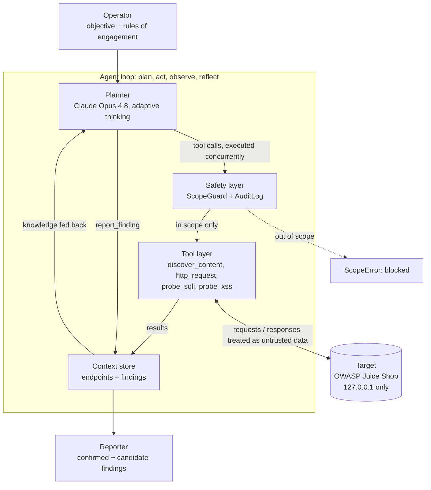
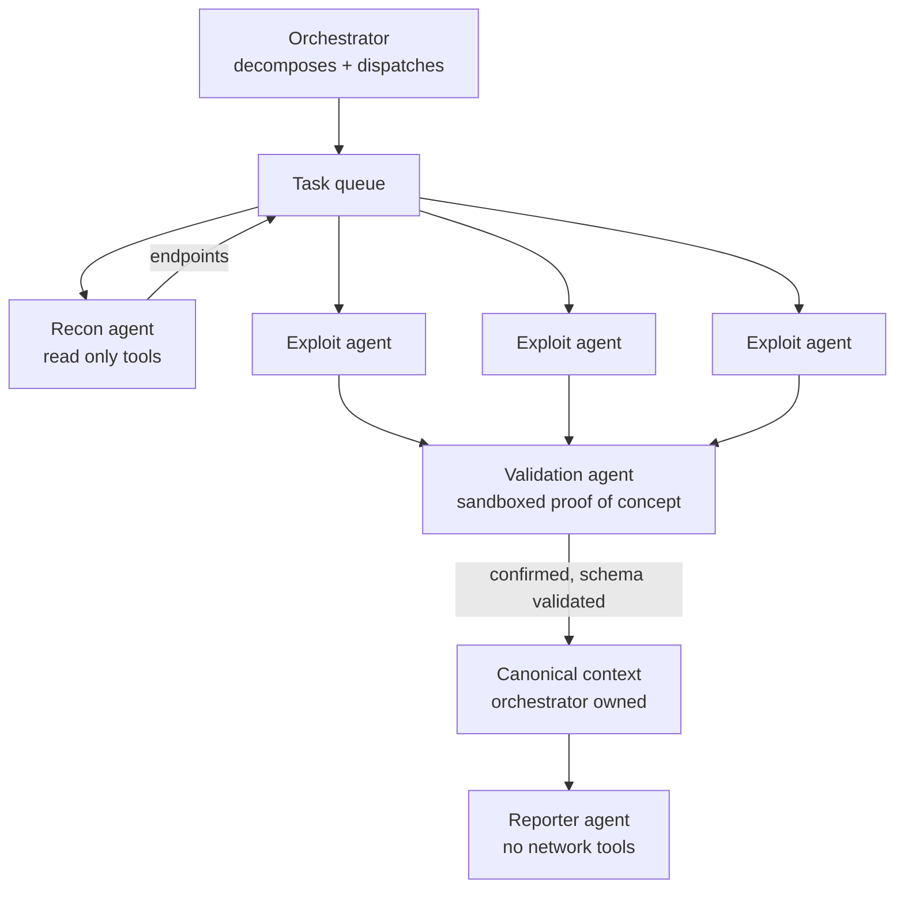

# Autonomous AI Pen Tester: Design

## Overview

An LLM planner runs an authorized penetration test end to end. It reasons over a
target, calls tools to recon, probe, and confirm vulnerabilities, and reports
what it finds. Every action passes through a safety layer that enforces the
authorized scope in code, not in a prompt, so the agent physically cannot act
outside the rules of engagement. The design is organized around four properties:
safe, contextual, effective, and concurrent.

## Architecture

## The four pillars

* **Safe.** Scope is an allowlist of hosts and ports enforced in code in
  `ScopeGuard.check_url`, which runs before every request. The agent ingests
  untrusted response bodies as data, never as instructions. Every action is
  written to an append only audit log. A per host request budget and rate limit
  bound the blast radius. Realized in `safety.py`.
* **Contextual.** A `Context` store holds the endpoints discovered and the
  findings recorded, and feeds a summary back to the planner so each decision is
  informed and work is not repeated. Realized in `context.py`.
* **Effective.** The agent does not just match patterns. It reasons about which
  parameters to probe, confirms candidates from real tool results, and records
  only what the evidence supports. Realized across `agent.py` and `tools.py`.
* **Concurrent.** Independent probes run in parallel. Within a turn, the agent
  fans out multiple tool calls executed with `asyncio.gather`; within a tool,
  `discover_content` probes many paths at once. A bounded semaphore plus a per
  second rate limit keep it from overwhelming the target. Realized in `agent.py`
  and `tools.py`.

## Components

| Component | File | Responsibility |
|---|---|---|
| Configuration and rules of engagement | `config.py` | Scope allowlist, limits, model |
| Safety layer | `safety.py` | ScopeGuard, AuditLog |
| Tool layer | `tools.py` | Scope checked, rate limited, concurrent tools |
| Context store | `context.py` | Endpoints and findings, planner summary |
| Planner | `agent.py` | The plan, act, observe, reflect loop |
| Reporter | `report.py` | Confirmed and candidate findings |
| Entry point | `main.py` | Wires it together, reads the key from env |

## The loop

1. The operator gives an objective and a scope.
2. The planner reasons and emits one or more tool calls.
3. Each call passes through the safety layer. Out of scope calls are blocked in
   code with a ScopeError before any packet leaves.
4. In scope calls run, concurrently, and are recorded in the audit log.
5. Results update the context store and return to the planner as data.
6. The planner reflects and either probes further or records a finding.
7. When the surface is covered, it ends its turn and the reporter renders the
   findings.

## Safety model (the lead concern)

Because this is a tool that attacks systems, safety is the hard constraint, not a
feature.

* Scope is enforced at the tool and network layer, in code, never only in the
  prompt, because a prompt boundary can be jailbroken.
* Tool response bodies are untrusted input. A malicious target could plant
  instructions in an error message, so the planner is told, and structured to
  treat, all tool output as data.
* The audit log is the forensic trail that proves the engagement stayed in scope.
* Request budgets and rate limits cap the blast radius and avoid denial of
  service on the target.
* In a full build, destructive or high impact actions sit behind a human
  approval gate, with graduated autonomy by action impact.

## What is built now versus a full development cycle

Built now (the demo):
* One authorized target, an intentionally vulnerable app, so it is safe and legal.
* The planner loop with Opus 4.8 and four tools plus a finding recorder.
* Concurrency, a scope allowlist, an audit log, and a report, end to end.

Full development cycle (the vision):
* Multi protocol coverage: web, API, network, cloud, and code.
* A pluggable tool registry over MCP, and specialized recon, exploit, validation,
  and reporting agents.
* A distributed, horizontally scalable worker fleet rather than threads on one box.
* A target knowledge graph and cross engagement learning.
* A full rules of engagement engine as policy as code, with graduated autonomy and
  an authorization workflow.
* An eval harness measuring coverage, precision, and false positive rate against
  known vulnerable corpora.
* Findings feeding into a remediation product, so the offensive agent finds it and
  the defensive agent fixes it.

## Scaling to multiple agents

The single agent loop becomes a fleet under an orchestrator. Three concerns
drive that design: how to marshal many agents, how to keep each one least
privileged, and how to validate the data flowing between them.

### Marshalling several agents

An orchestrator decomposes the engagement into independent units (per host, per
endpoint cluster, per vuln class) and fans them out. Two shapes:

* Worker pool: dispatch units to many copies of the same agent, run concurrently
  under a bounded semaphore, the same pattern as our tool concurrency one level
  up. The distributed version is a task queue plus a stateless worker fleet.
* Specialized pipeline: a recon agent maps the surface, hands endpoints to a pool
  of exploit agents, confirmed candidates go to validation agents, a reporter
  aggregates.

Coordination is a shared task queue plus one canonical context the orchestrator
owns. Workers get a scoped slice and write back through a controlled interface,
never directly. Concurrency is bounded so the fleet does not deny service to the
target or exhaust the token budget, and a shared seen set dedups work.

### Least privilege per agent

Each agent gets only the tools and scope it needs, enforced in code, not the
prompt. A recon agent gets read only discover and request, not the exploit
probes. A reporter gets no network tools at all. Mechanism: instead of one shared
Toolbox, give each agent its own Toolbox with its own ScopeGuard, scoped tighter
than the global rules, so a worker assigned one host can only touch that host.
Credentials follow the same rule: the orchestrator holds the key, workers get
short lived scoped tokens or call through it. High impact actions sit behind an
approval gate that only certain agents may even request.

Each agent also gets its own budgets, a request budget, a token and cost budget,
and a step ceiling, allocated as a slice of the engagement total, so one worker
cannot drain the whole run. For isolation stronger than the in code check alone,
each agent can run in its own container with network egress filtering, which
enforces the same scope at the operating system and network layer as defense in
depth, so the boundary holds even if the in code check is ever bypassed. Every
action an agent takes is logged with that agent's identity, so the audit trail
attributes each request to a specific agent, which gives accountability and a way
to spot a misbehaving one.

### Validation between agents

In a fleet, one agent's output is the next one's input, and target responses flow
through both. Two threats: malformed data breaking the pipeline, and prompt
injection propagating between agents.

* Strict schemas at every boundary. Inter agent handoffs and tool outputs validate
  against a schema before they are accepted. Our `Context.add_finding` is exactly
  this boundary: the orchestrator validates the finding shape, that the URL is in
  scope, and that evidence is present, before merging.
* Treat data from other agents as untrusted, not just data from the target. An
  agent's output is data to the next agent, never instructions, delimited and
  labeled as such in the receiving prompt.
* Provenance tagging. Tag each value with its source: operator, agent, or target.
  Target derived strings can never become tool arguments without validation,
  which stops an agent being steered by injected content.
* Sanitize and bound at each hop: type and range checks, length caps, strip
  control characters, before passing the value on.

These controls map to recognized frameworks. Least privilege per agent is NIST
AC-6, trusting no component implicitly is a zero trust stance applied between your
own agents, and the risks being closed are OWASP LLM07 insecure tool and plugin
design and OWASP LLM08 excessive agency.
