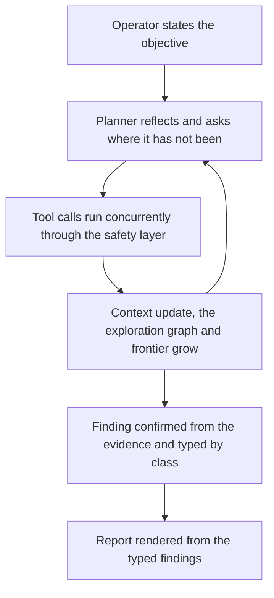

# Ariadne

Ariadne is an autonomous AI penetration tester, and underneath that it is an
experiment in engineering trustworthy autonomy for offensive security tools. A
language model plans and drives the engagement, but it operates inside a boundary it
cannot cross, and that boundary, not the model, is the point.

## What is interesting here

The interesting part is not that a model can make HTTP requests. It is that the model
is constrained to act only within an explicit safety and engagement boundary while
still planning autonomously inside it. Scope is enforced in code rather than asked
for in a prompt, every action passes through a safety layer and lands in an append
only audit log, the tools are few and typed, and the agent reasons over an explicit
map of where it has and has not been.

The planner is the one swappable part. It is Claude today and could be a different
model tomorrow, and the architecture does not change when it is swapped, because the
guarantees live in the code around the model and not in the model itself. That is
what gives the design a longer shelf life than any single model, and it is the real
subject, a principled architecture for building constrained autonomous security
agents.

## How a request travels

Every action moves down through the layers and back up, and the model never touches
the network directly.

```
Claude
  ↓
Planner          decides the next move from the exploration map
  ↓
Tool layer       the only way to act, typed and least privileged
  ↓
Scope guard      enforces the host and port allowlist in code
  ↓
HTTP             the request finally reaches the authorized target
  ↓
Observation      the response comes back as untrusted data
  ↓
Context          the exploration graph and findings are updated
  ↓
Planner          reads the new map and asks where it has not been
```

## The autonomy loop

The operator sets one objective. The planner then reflects, acts, and updates its
map in a loop until the frontier, the set of places it has not been, is covered.



A real pass against OWASP Juice Shop went like this.

1. Operator objective. Test the authorized target for web vulnerabilities.
2. Planner decision. The map is empty, so the planner reflects that its goal is to
   find the surface, its unknown is every path, and its hypothesis is that common API
   routes exist. It calls discover_content.
3. Tool calls. discover_content probes many paths at once through the concurrency
   gate and reports that /api/Feedbacks exists.
4. Context update. The exploration graph gains the /api/Feedbacks node, and the
   frontier now shows that the endpoint has been reached but not read.
5. Planner decision. Asking where it has not been, the planner calls http_request on
   /api/Feedbacks and reads the response as data.
6. Finding confirmation. The response returns every feedback record with no
   authentication, including masked emails and content referencing wallet seed
   phrases. The planner records an information disclosure finding, which carries
   CWE-200 and its remediation automatically, and marks it confirmed.
7. Report. When the frontier is covered the planner ends its turn, and the report is
   rendered straight from the typed findings.

See [DESIGN.md](DESIGN.md) for the full architecture and
[THREAT_MODEL.md](THREAT_MODEL.md) for the agent threat model.

## Run

Requires Python, an authorized target, and ANTHROPIC_API_KEY in the environment.

```
python3 -m venv .venv
source .venv/bin/activate
pip install -r requirements.txt
export ANTHROPIC_API_KEY=...
python -m pentester.main
```

## Disclaimer

This software is provided as is, without warranty of any kind, express or
implied, including but not limited to the warranties of merchantability, fitness
for a particular purpose, and noninfringement. Use it only against systems you
own or are explicitly authorized to test.

## License

Copyright (C) 2026 Charlotte Townsley.

This program is free software. You can redistribute it and modify it under the
terms of the GNU General Public License as published by the Free Software
Foundation, version 3. The full license text is in the LICENSE file and at
https://www.gnu.org/licenses/gpl-3.0.html.

This program is distributed in the hope that it will be useful, but WITHOUT ANY
WARRANTY, without even the implied warranty of MERCHANTABILITY or FITNESS FOR A
PARTICULAR PURPOSE. See the GNU General Public License for more details.
