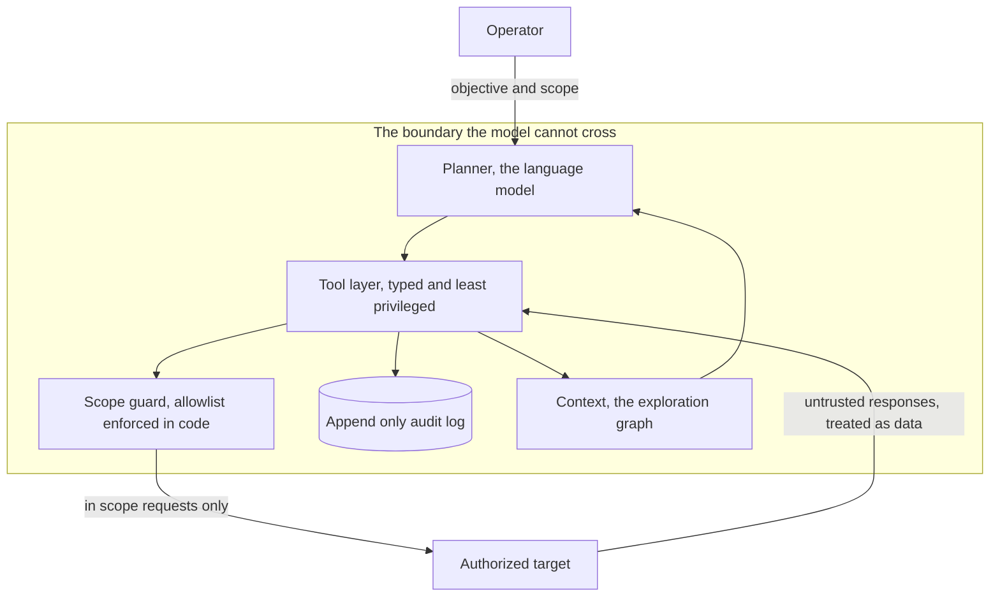
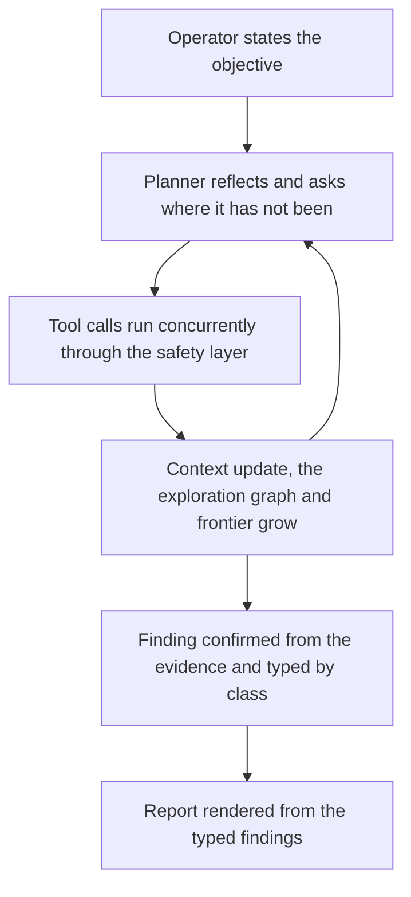

# Ariadne

Ariadne is a case study in applying security engineering principles to the design of autonomous agents. The penetration testing agent is the vehicle, and the architectural principles are the real contribution. A language model plans and drives the engagement, but it operates inside a boundary it cannot cross, and that boundary, not the model, is the point.



<p align="center"><a href="https://youtu.be/5tpyjqRoxCQ"></a></p>

Ariadne is paired with an original piano piece and a short film, both my own original composition, performance, and production, made without any AI. The myth, the music, the visuals, and the software are one story told from four sides, the navigation of a labyrinth and the thread that leads back out. The loop above is from that film. Watch the full film and read about the art at [The Art](ART.md).

## What is interesting here

The interesting part is not that a model can make HTTP requests. It is that the model is constrained to act only within an explicit safety and engagement boundary while still planning autonomously inside it. Scope is enforced in code rather than asked for in a prompt, every action passes through a safety layer and lands in an append only audit log, the tools are few and typed, and the agent reasons over an explicit map of where it has and has not been.

The planner is the one swappable part. It is one model today and could be a different model tomorrow, and the architecture does not change when it is swapped, because the guarantees live in the code around the model and not in the model itself. That is what gives the design a longer shelf life than any single model, and it is the real subject, a principled architecture for building constrained autonomous security agents.

## How a request travels

Every action moves down through the layers and back up, and the model never touches the network directly.

```
Planner          decides the next move from the exploration map
  ↓
Tool layer       the only way to act, typed and least privileged
  ↓
Scope guard      enforces the host and port allowlist in code
  ↓
HTTP             the request finally reaches the authorized target
  ↓
Observation      the response comes back as untrusted data
  ↓
Context          the exploration graph and findings are updated
  ↓
Planner          reads the new map and asks where it has not been
```

## The autonomy loop

The operator sets one objective. The planner then reflects, acts, and updates its map in a loop until the frontier, the set of places it has not been, is covered.



## End to end

Here is one engagement from the objective to the report.

The target is a local OWASP Juice Shop at http://127.0.0.1:3000, the only host and port in scope.

The agent's reasoning at the moment it found the issue, recorded by the reflect tool and written to the audit log, looked like this.

```
goal:            map the API surface and find an endpoint that leaks data
evidence:        discover_content found /api/Feedbacks returning 200
confidence:      medium
unknowns:        whether /api/Feedbacks requires authentication
next_hypothesis: the endpoint returns records to an unauthenticated caller
```

The resulting report, generated straight from the typed findings, looked like this.

```
# Penetration Test Report
Target: http://127.0.0.1:3000

Confirmed findings: 1
Candidate findings: 0

## [CONFIRMED] HIGH Sensitive Information Disclosure
Weakness: CWE-200
URL: http://127.0.0.1:3000/api/Feedbacks
Evidence: the endpoint returned every feedback record without authentication,
including partially masked emails and content referencing wallet seed phrases.
Remediation: Require authentication and authorization on the endpoint, and remove
sensitive data from responses that do not need to carry it.

## Exploration map
http://127.0.0.1:3000
    / [200]
      /api/Feedbacks [200]
        sqli not tested
        xss not tested
        finding [confirmed] Sensitive Information Disclosure CWE-200
```

The agent reached the finding by mapping the surface, asking where it had not been, reading the endpoint, treating the response as data, and confirming the disclosure from the evidence, and the report wrote itself because the finding type already carried the weakness and the remediation.

## The labyrinth

The name is not decoration. Ariadne is the one who gives the thread that lets you go deep into the labyrinth and find the way back, and that is exactly what the architecture does, it lets the agent go deep into a target and always return safely in bounds. Care, memory, and clear boundaries are what let you venture into something dangerous and still find your way home, and in the software those three are the safety model, the exploration graph and the audit log, and the scope enforced in code. The accompanying music walks the same path, down into a minor key, up to a high exposed middle, an arrival, and a quiet return. The short film walks it visually, and the multiplied dancers in it are the concurrent agents, many threads laid through the maze at once and every one still finding the way back. The project is not about exploiting machines, it is about navigating a labyrinth and finding the way back, told four ways at once.

## Read more

The article [Designing a Trustworthy Autonomous Penetration Testing Agent](ARTICLE.md) covers the architectural choices in depth. See [DESIGN.md](DESIGN.md) for the architecture and diagrams, [THREAT_MODEL.md](THREAT_MODEL.md) for the agent threat model, and [The Art](ART.md) for the film and the music.

## Run

Requires Python, an authorized target, and ANTHROPIC_API_KEY in the environment.

```
python3 -m venv .venv
source .venv/bin/activate
pip install -r requirements.txt
export ANTHROPIC_API_KEY=...
python -m pentester.main
```

## Disclaimer

This software is provided as is, without warranty of any kind, express or implied, including but not limited to the warranties of merchantability, fitness for a particular purpose, and noninfringement. Use it only against systems you own or are explicitly authorized to test.

## License

Copyright (C) 2026 Charlotte Townsley.

This program is free software. You can redistribute it and modify it under the terms of the GNU General Public License as published by the Free Software Foundation, version 3. The full license text is in the LICENSE file and at https://www.gnu.org/licenses/gpl-3.0.html.

This program is distributed in the hope that it will be useful, but WITHOUT ANY WARRANTY, without even the implied warranty of MERCHANTABILITY or FITNESS FOR A PARTICULAR PURPOSE. See the GNU General Public License for more details.
