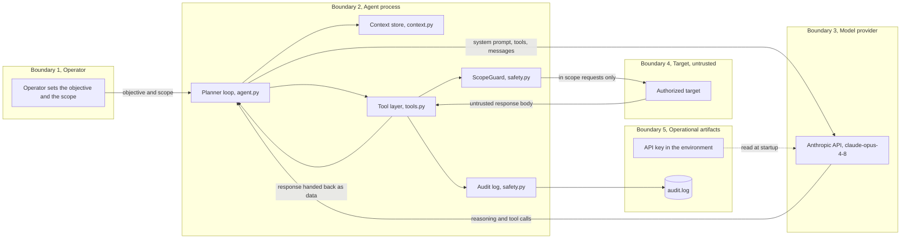

# Threat Model

This document models Ariadne, an autonomous AI penetration tester, for security review. Ariadne is not a web service, so the threat surface is not an inbound API. It is an agent surface, where a language model plans actions, calls tools, and reads data from a target that is hostile by definition. The frames used here are STRIDE for the classic categories, the OWASP Top 10 for LLM Applications for the model and agent specific risks, and MITRE ATLAS for the adversarial machine learning techniques.

## Architecture and trust boundaries

### The boundary crossings that matter most

* The target to the agent, which is Boundary 4 into Boundary 2. The target is hostile
  and its response bodies are untrusted input. This is the indirect prompt injection
  vector and the single most important boundary in the whole design.
* The agent to the model, which is Boundary 2 into Boundary 3. The prompt could carry
  data harvested from the target, so anything sensitive in a response could be sent
  onward to the model and logged.
* The agent to the target, which is Boundary 2 into Boundary 4. This is where the
  agent acts, and where excessive agency would show up if it were not constrained.
* The operator to the agent, which is Boundary 1 into Boundary 2. The scope and the
  objective are set here, and the scope is the contract that everything else enforces.

## Sensitive assets

* The authorization scope itself, since a weakened scope turns a legitimate tool into
  an unbounded one.
* The Anthropic API key, held only in the environment.
* The audit log, which is the evidence that the engagement stayed in bounds.
* Any sensitive data the target returns, which the agent must not leak or be steered
  by.

## OWASP Top 10 for LLM Applications

This is the core of the model, because these are the risks specific to an LLM driven agent. Each row names the risk, the control that exists in code today, and the planned hardening where the control is partial.

| Risk | Threat to Ariadne | Control today | Status |
|---|---|---|---|
| LLM01 Prompt injection | A target plants text in its own response to hijack the agent, which is indirect prompt injection across Boundary 4 | Response bodies are treated as data and never as instructions, they are truncated to a fixed size, and the system prompt sets an instruction hierarchy as defense in depth. Safety does not depend on the model obeying the prompt, because the scope is enforced in code | Partial, an injection pattern detector that flags and logs suspicious responses is planned |
| LLM02 Insecure output handling | The model emits a tool call that asks for an unsafe action | Tool inputs are typed and enumerated in the schema, and every action passes through the ScopeGuard before it can run | Mitigated, stricter argument validation before dispatch is planned |
| LLM03 Training data poisoning | Not applicable, Ariadne uses a hosted model and does no training | Not applicable | Not applicable |
| LLM04 Model denial of service | A runaway loop or an injection drives unbounded requests or unbounded model spend | A per host request budget, an outbound rate limit, a bounded concurrency semaphore, and a hard cap on planner steps all bound the work | Partial, a per run token and cost budget read from the API usage is planned |
| LLM05 Supply chain | A compromised dependency or an unpinned model changes behavior | Dependencies are pinned with SHA256 hashes and verified in CI, pip-audit and CodeQL and Bandit run on every change, and the model id is pinned to an exact version | Mitigated |
| LLM06 Sensitive information disclosure | The agent harvests a secret from a target response and leaks it into the prompt or the log | The API key is never on disk, and the audit log is local and append only | Partial, a redaction pass over tool output and the log is planned |
| LLM07 Insecure plugin and tool design | A tool grants more capability than intended | Tools are few, narrow, and all routed through the safety layer, with no direct network path for the model | Mitigated |
| LLM08 Excessive agency | The agent acts outside the authorized scope | The ScopeGuard enforces a host and port allowlist in code, with a per host budget and a planner step ceiling, so an out of scope action is impossible rather than discouraged | Mitigated, an optional human approval gate for higher impact actions is planned |
| LLM09 Overreliance | A finding is reported without real evidence | A finding carries a confirmed flag that is only set on evidence from a tool result, separating proven exploits from candidates | Mitigated |
| LLM10 Model theft | Not applicable, the model weights are not hosted here | Not applicable | Not applicable |

## MITRE ATLAS techniques

The adversary here is the target attempting to subvert the agent through the data it returns. The relevant ATLAS techniques are LLM Prompt Injection, where the target embeds instructions in its response, LLM Jailbreak, where the embedded text tries to override the rules of engagement, and LLM Data Leakage, where the target tries to make the agent reveal its key, its scope, or data from another context. The untrusted response handling and the in code scope enforcement are the primary mitigations, and the planned injection detector and redaction pass close the remaining gap.

## STRIDE summary

| Category | Threat | Mitigation |
|---|---|---|
| Spoofing | A redirect or a crafted URL sends a request to a host the operator never authorized | Host and port are parsed and checked against the allowlist in code, and redirects are not followed |
| Tampering | The audit log is altered to hide what the agent did | The log is append only with one JSON object per line, planned hardening adds a hash chain and a remote sink |
| Repudiation | An action happens with no record | Every request and every step is recorded before it is taken, so intent is logged even on failure |
| Information disclosure | A secret from a target response leaks into the prompt or the log | The key is off disk, planned hardening adds redaction of tool output and the log |
| Denial of service | A loop or an injection drives unbounded requests or spend | Request budget, rate limit, concurrency cap, and step ceiling, planned hardening adds a token budget |
| Elevation of privilege | The model is steered into acting beyond its tools or scope | The model has no direct network access, every action passes the safety layer, and scope is enforced in code |

## Residual risk and the hardening roadmap

The design is strong on excessive agency and on the supply chain, because those are enforced in code and in CI. The remaining work is on the model and data handling boundary, and it is deliberately listed as planned rather than claimed as done.

* An indirect prompt injection detector that scans every response for instruction like
  patterns, flags them, and records a security event, which strengthens LLM01.
* A redaction pass that strips API keys, tokens, and obvious secrets out of tool output
  and the audit log before either is kept or sent onward, which strengthens LLM06.
* A per run token and cost budget read from the API usage, which strengthens LLM04.
* An optional human approval gate before higher impact actions, which strengthens
  LLM08.
* Model and prompt provenance in the audit log, recording the model id, a hash of the
  system prompt, and the token usage per run, for reproducibility and forensics.
* A hash chain over the audit records and a remote sink, so the log is tamper evident
  even if the host is compromised.

## Review cadence

* Before each engagement, confirm the scope allowlist matches the written authorization.
* On every change, the automated scans in CI act as a continuous review of the code and
  the dependencies.
* After any incident, update this model immediately if the agent reached anything it
  should not have.
